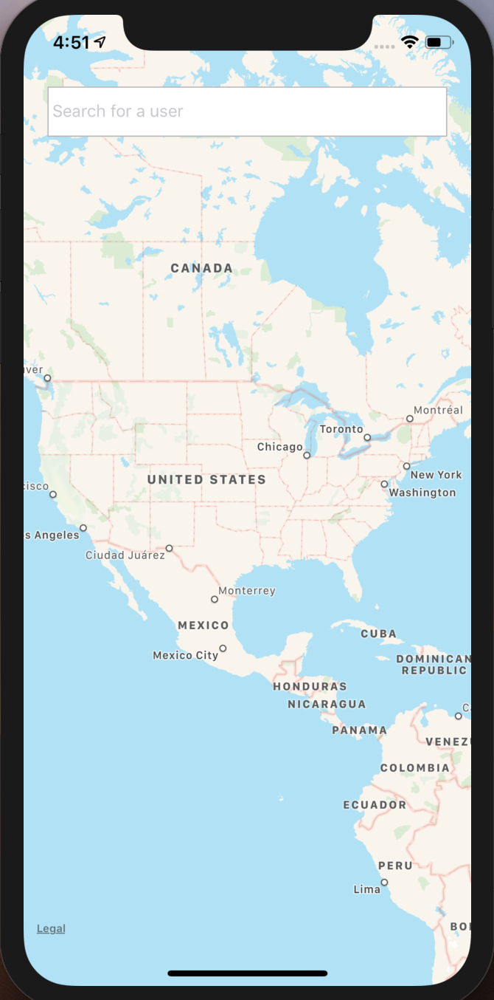
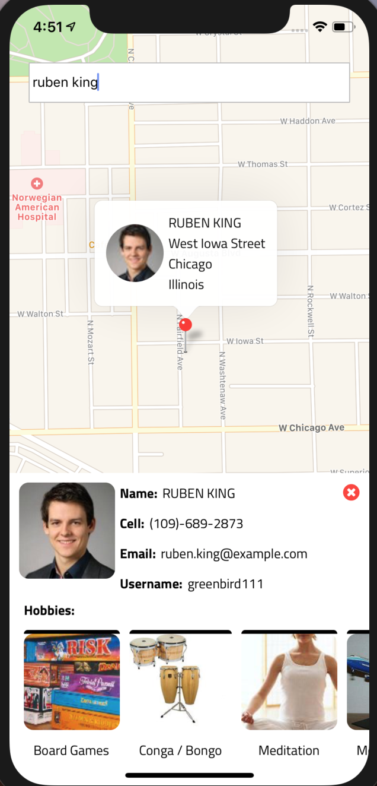
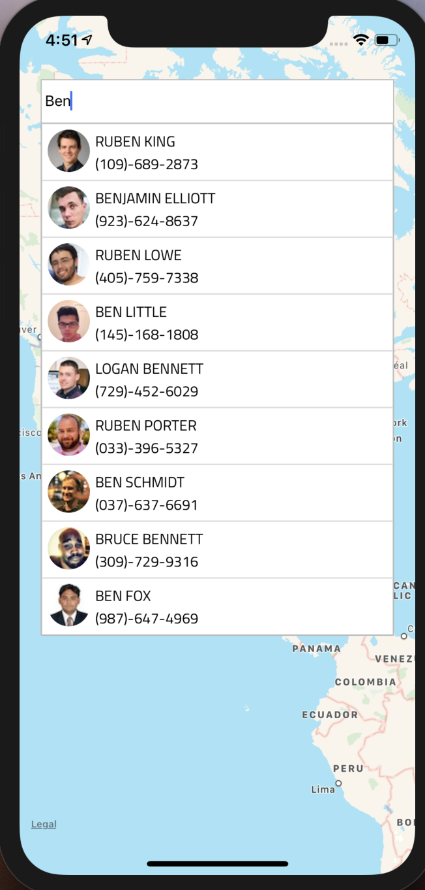

This project was for TruckMaps. I made a react native application where a user can search for a person in the searchbar, and names will pop up that match the search input. The searchbar is dynamic after every key stroke. When the user searches for a person, the person's location will pop up on the map, and their detail card will animate up onto the screen. The user can click on the location pin to see location details, and they can see the person's details on the details card. The card animates up and down. 

There is a hobbies section in the detail card, and that has horizontal scroll functionality. I used redux to manage application state. If I were to continue with this application. I would add more icons in and add weather data onto the map. I also would add more details to the person's details card and show places on the map that the user might be interested in other than just people. 

